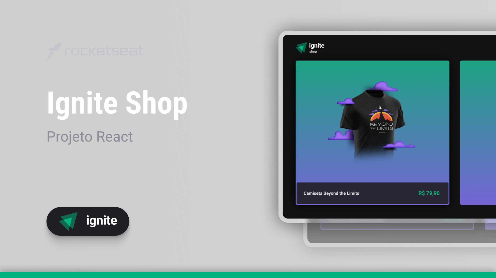
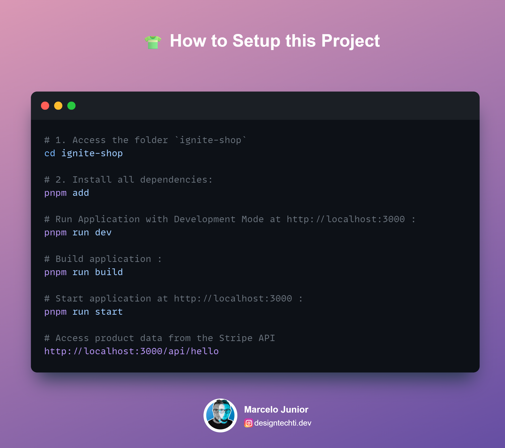
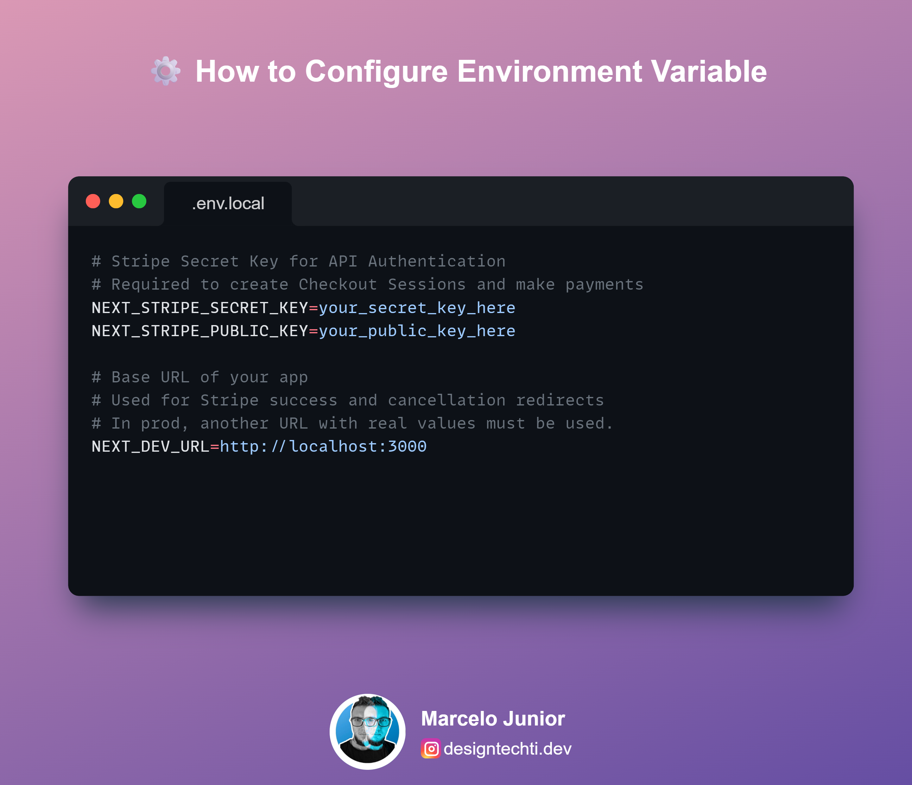

# 👕Ignite Shop - E-commerce 🛒

## 🚀 About this Project

A mini e-commerce to sell custom Rocketseat t-shirts developed during the React.js track classes at the Ignite bootcamp using Next.js + Stripe

## 📱 Features

- 🛒 Product Catalog and Dynamic Pages
- 🧭 Optimized Browsing Navigation
- 🛡️ Safe Checkout with Redirection
- ✅ Post-Purchase Visual Feedback

## 🎨 Figma Layout

You can view its layout throughth [this link](https://www.figma.com/file/OIJJEW24DFiJO6XLqHw2DM/Ignite-Shop/).

## ⚡ Technologies Envolved

 
 
 
 

## 🔧 Setup

## 🤝 Contributing

Contributions are always welcome! Here's how you can contribute:

1. Fork the project
2. Create a Branch for your Feature (`git checkout -b feature/AmazingFeature`)
3. Add your changes (`git add .`)
4. Commit your changes (`git commit -m 'Add some AmazingFeature'`)
5. Push to the Branch (`git push origin feature/AmazingFeature`)
6. Open a Pull Request

## 📄 License

This project is licensed under the [MIT License](LICENSE). See the LICENSE file for more details.

## 👨‍💻 Author

<table width="100%">

<tr>

<td align="center">

<a href="https://github.com/designtechti490">

 

<b>Marcelo Junior</b>
          <i>Front End Developer</i>

</a>

</td>

</tr>

</table>

---

 Developed with 💜 during Rocketseat's Ignite bootcamp 

